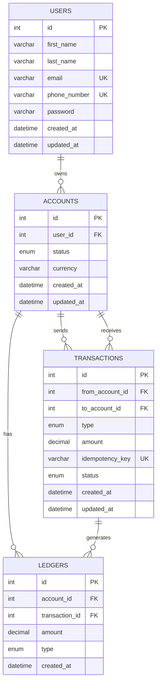

# Demo Credit Wallet
**Test and view the complete API documentation using Postman:** [View API](https://www.postman.com/oopaletijohnson-630712/demo-credit-wallet/collection/uoiun8y/credit-wallet?action=share&creator=53839187)

A secure and transactional **digital credit wallet API** built with **Node.js, TypeScript, Express.js, Knex.js, and MySQL**.

The system provides core wallet functionality including:

* User registration and authentication
* Adjutor/Karma blacklist screening
* Wallet account creation and management
* Account funding
* Transfers between accounts
* Withdrawals
* Transaction tracking
* Ledger-based balance calculation
* Idempotency protection
* Database transactions
* Row-level locking
* Input validation
* Centralized error handling
* Unit testing of core business logic

---

## Overview

Demo Credit Wallet is a backend implementation of a digital wallet designed around **financial data integrity, transactional consistency, and maintainable backend architecture**.

The application demonstrates backend engineering principles relevant to financial systems, including:

* Layered architecture
* Object-oriented programming
* Authentication and authorization
* Secure password hashing
* JWT-based authentication
* Account ownership protection
* Ledger-based financial accounting
* Atomic database transactions
* Row-level locking
* Deterministic lock ordering
* Idempotent financial operations
* Transaction status management
* Insufficient-balance protection
* Account status validation
* External user-risk validation through Lendsqr Adjutor/Karma
* Positive and negative unit testing

---

# Architecture

The application follows a layered architecture:

```text
                    Client
                      │
                      ▼
               Express Routes
                      │
                      ▼
                 Middleware
                      │
                      ▼
                 Controllers
                      │
                      ▼
                  Services
                      │
                      ▼
                Repositories
                      │
                      ▼
                   Knex.js
                      │
                      ▼
                    MySQL
```

### Routes

Define semantic API resources and HTTP endpoints.

Examples:

```text
/api/v1/auth
/api/v1/accounts
/api/v1/transactions
```

Authentication middleware is applied to protected routes.

### Controllers

Controllers handle HTTP concerns:

* Reading request parameters/body
* Performing request-level validation
* Calling application services
* Returning HTTP responses
* Passing errors to centralized error handling

Controllers do not contain financial business rules.

### Services

Services contain the application's core business logic.

Examples:

* `AuthService`
* `AccountService`
* `TransactionService`
* `KarmaService`

The `TransactionService` is responsible for enforcing transaction rules such as:

* Valid transaction amounts
* Idempotency
* Account status
* Balance validation
* Transaction creation
* Ledger creation
* Transaction boundaries

### Repositories

Repositories isolate database persistence logic from business logic.

Examples:

* `UserRepository`
* `AccountRepository`
* `TransactionRepository`
* `LedgerRepository`

This separation makes the service layer easier to test because repositories can be mocked during unit tests.

### Knex.js

Knex provides:

* SQL query building
* Database abstraction
* Database migrations
* Transaction management
* Row-level locking support

### MySQL

MySQL provides persistent storage for:

* Users
* Accounts
* Transactions
* Ledger entries

---

# Entity Relationship Diagram

GitHub supports Mermaid diagrams directly inside Markdown files.



## Relationship Summary

| Relationship                 | Description                                                       |
| ---------------------------- | ----------------------------------------------------------------- |
| User → Accounts              | A user can own one or more wallet accounts                        |
| Account → Transactions       | An account can participate as a sender or receiver                |
| Account → Ledger Entries     | Ledger entries record financial movements affecting an account    |
| Transaction → Ledger Entries | A transaction produces the corresponding financial ledger entries |
| Transaction → Accounts       | Transactions reference the accounts involved in the operation     |

---

# Database Design

The database separates **account identity**, **transaction intent**, and **financial movements**.

### Users

Stores authentication and user identity information.

### Accounts

Represents a user's wallet account.

An account contains:

* Owner
* Currency
* Status
* Timestamps

Supported account states:

```text
ACTIVE
FROZEN
CLOSED
```

### Transactions

Represents the business operation requested by a client.

Supported transaction types:

```text
FUNDING
TRANSFER
WITHDRAWAL
```

Supported transaction states:

```text
PENDING
COMPLETED
FAILED
```

### Ledgers

Records the actual financial movement associated with a transaction.

This creates an auditable history of credits and debits.

---

# Ledger-Based Balance Model

The account balance is derived from ledger entries:

```text
Balance = Total Credits - Total Debits
```

For example:

```text
Funding       + ₦10,000
Transfer      - ₦3,000
Withdrawal    - ₦2,000
----------------------
Balance       ₦5,000
```

The ledger provides a traceable record of financial movements instead of relying exclusively on a mutable balance field.

---

# Authentication

The API uses **JWT-based authentication**.

## Signup Flow

During registration:

```text
Client
  │
  ▼
Validate request
  │
  ▼
Normalize email
  │
  ▼
Check existing user
  │
  ▼
Karma blacklist screening
  │
  ├── Blacklisted → Reject onboarding
  │
  ▼
Hash password
  │
  ▼
Create user
  │
  ▼
Create default NGN account
  │
  ▼
Commit transaction
  │
  ▼
Generate JWT
```

User creation and default account creation occur inside the same database transaction to prevent partially completed onboarding.

## Password Security

Passwords are hashed using `bcrypt` before being stored.

Plain-text passwords are never persisted.

## Login

Users authenticate using:

```text
email + password
```

The password is verified using bcrypt and a JWT is generated after successful authentication.

## Protected Endpoints

Protected endpoints require:

```http
Authorization: Bearer <token>
```

The authentication middleware validates the token and attaches the authenticated user's identity to the request.

---

# Lendsqr Adjutor/Karma Blacklist Screening

A critical onboarding requirement is that:

> **A user with a valid record in the Lendsqr Adjutor Karma blacklist must not be onboarded.**

During signup, the application checks the user's identifying information against Karma before creating the user.

The flow is:

```text
Signup Request
      │
      ▼
Extract email + phone
      │
      ▼
Karma Lookup
      │
      ├── Blacklisted → Reject signup
      │
      └── Clear → Continue onboarding
```

The application therefore performs blacklist screening **before persistence of the new user**.

For development/test environments where Adjutor returns its mock/test response, the mock response is handled separately so development can continue without treating the test fixture as a genuine blacklist match.

In production, a genuine blacklist match prevents onboarding.

---

# Wallet Operations

## Fund Account

Adds funds to an account.

### Processing Flow

```text
Request
   ↓
Validate amount
   ↓
Validate idempotency key
   ↓
Lock account
   ↓
Validate account
   ↓
Validate account status
   ↓
Create transaction
   ↓
Create CREDIT ledger entry
   ↓
Mark transaction COMPLETED
   ↓
Commit
```

A successful funding operation creates:

```text
Transaction: FUNDING
Ledger: CREDIT
```

---

# Transfer Funds

Transfers funds between two accounts.

### Processing Flow

```text
Request
   ↓
Validate amount
   ↓
Validate idempotency key
   ↓
Validate source/target accounts
   ↓
Lock accounts
   ↓
Validate account status
   ↓
Check sender balance
   ↓
Create transaction
   ↓
Create sender DEBIT
   ↓
Create receiver CREDIT
   ↓
Mark transaction COMPLETED
   ↓
Commit
```

For a ₦3,000 transfer:

```text
Sender Account
      │
      │ DEBIT ₦3,000
      ▼
 Transaction
      │
      │ CREDIT ₦3,000
      ▼
Receiver Account
```

Both ledger entries belong to the same transaction and are persisted atomically.

If any operation fails, the database transaction is rolled back.

---

# Withdraw Funds

Withdraws funds from an account.

### Processing Flow

```text
Request
   ↓
Validate amount
   ↓
Validate idempotency key
   ↓
Lock account
   ↓
Validate account
   ↓
Validate account status
   ↓
Check balance
   ↓
Create transaction
   ↓
Create DEBIT ledger entry
   ↓
Mark transaction COMPLETED
   ↓
Commit
```

A withdrawal is rejected when the available ledger balance is insufficient.

---

# Idempotency

All financial operations require an idempotency key:

* Funding
* Transfers
* Withdrawals

Example:

```http
POST /api/v1/transactions/fund
```

```json
{
  "accountId": 1,
  "amount": 10000,
  "idempotencyKey": "fund-001"
}
```

The idempotency key is stored with the transaction and uniquely identifies the operation.

If the same request is submitted again using the same key, the existing transaction is returned instead of creating another financial movement.

This protects against duplicate processing caused by:

* Network retries
* Client retries
* Request timeouts
* Duplicate submissions

Example:

```text
First request
    ↓
Transfer ₦5,000
    ↓
Transaction created

Retry with same idempotency key
    ↓
Existing transaction found
    ↓
No second transfer
```

---

# Database Transactions & Transaction Scoping

Financial operations use database transactions through Knex.

The transaction boundary is intentionally placed around **all database operations that must succeed or fail together**.

For example, a transfer contains:

```text
BEGIN
  │
  ├── Lock sender
  ├── Lock receiver
  ├── Validate accounts
  ├── Check balance
  ├── Create transaction
  ├── Create sender debit
  ├── Create receiver credit
  └── Mark transaction completed
  │
COMMIT
```

If an operation fails:

```text
ROLLBACK
```

This prevents partial financial state.

For example, the following state must never be committed:

```text
Sender debited
Receiver NOT credited
```

Instead, the complete operation is atomic:

```text
Sender debited
      +
Receiver credited
      +
Transaction completed
```

---

# Concurrency Control

The application uses row-level locking for accounts involved in financial operations.

Conceptually:

```sql
SELECT ...
FROM accounts
WHERE id = ?
FOR UPDATE;
```

This prevents concurrent operations from independently reading and spending the same available balance.

For transfers involving two accounts, the accounts are locked in deterministic ID order:

```text
smaller account ID
        ↓
larger account ID
```

This reduces the possibility of deadlocks caused by competing transactions acquiring the same locks in different orders.

---

# Transaction Types

| Type         | Description                             |
| ------------ | --------------------------------------- |
| `FUNDING`    | Adds funds to an account                |
| `TRANSFER`   | Moves funds from one account to another |
| `WITHDRAWAL` | Removes funds from an account           |

## Transaction Statuses

| Status      | Description                                    |
| ----------- | ---------------------------------------------- |
| `PENDING`   | Transaction has been created but not completed |
| `COMPLETED` | Transaction completed successfully             |
| `FAILED`    | Transaction failed                             |

---

# API Endpoints

Base URL:

```text
http://localhost:4200/api/v1
```

For a deployed environment, replace the base URL with the Render service URL.

## Authentication

| Method | Endpoint       | Auth | Description         |
| ------ | -------------- | ---- | ------------------- |
| POST   | `/auth/signup` | No   | Register a new user |
| POST   | `/auth/login`  | No   | Authenticate a user |
| POST   | `/auth/logout` | Yes  | Logout              |

## Accounts

| Method | Endpoint                       | Auth | Description         |
| ------ | ------------------------------ | ---- | ------------------- |
| POST   | `/accounts`                    | Yes  | Create an account   |
| GET    | `/accounts`                    | Yes  | Get user's accounts |
| GET    | `/accounts/:accountId/balance` | Yes  | Get account balance |

## Transactions

| Method | Endpoint                 | Auth | Description     |
| ------ | ------------------------ | ---- | --------------- |
| POST   | `/transactions/fund`     | Yes  | Fund an account |
| POST   | `/transactions/transfer` | Yes  | Transfer funds  |
| POST   | `/transactions/withdraw` | Yes  | Withdraw funds  |

---

# Example Requests

## Signup

```http
POST /api/v1/auth/signup
Content-Type: application/json
```

```json
{
  "first_name": "John",
  "last_name": "Doe",
  "email": "john@example.com",
  "phone_number": "08012345678",
  "password": "StrongPassword123"
}
```

## Login

```http
POST /api/v1/auth/login
Content-Type: application/json
```

```json
{
  "email": "john@example.com",
  "password": "StrongPassword123"
}
```

## Fund Account

```http
POST /api/v1/transactions/fund
Authorization: Bearer <token>
Content-Type: application/json
```

```json
{
  "accountId": 1,
  "amount": 10000,
  "idempotencyKey": "fund-001"
}
```

## Transfer Funds

```http
POST /api/v1/transactions/transfer
Authorization: Bearer <token>
Content-Type: application/json
```

```json
{
  "fromAccountId": 1,
  "toAccountId": 2,
  "amount": 3000,
  "idempotencyKey": "transfer-001"
}
```

## Withdraw Funds

```http
POST /api/v1/transactions/withdraw
Authorization: Bearer <token>
Content-Type: application/json
```

```json
{
  "accountId": 1,
  "amount": 2000,
  "idempotencyKey": "withdraw-001"
}
```

---

# Validation & Error Handling

The application uses centralized application errors.

Supported HTTP errors include:

```text
400 Bad Request
401 Unauthorized
403 Forbidden
404 Not Found
409 Conflict
```

Examples include:

* Invalid transaction amount
* Missing idempotency key
* Invalid credentials
* Account not found
* Inactive account
* Insufficient balance
* Duplicate transaction
* Unauthorized resource access
* Karma blacklist rejection

The service layer validates business rules while the controller handles request-level validation.

---

# Testing

The project uses **Jest** and `ts-jest`.

Tests cover both positive and negative business scenarios.

## Authentication Tests

Examples include:

* Successful signup
* Duplicate email rejection
* Invalid credentials
* Successful login
* Invalid password
* Karma blacklist rejection
* Logout

## Funding Tests

* User can fund an active account
* Non-existent account is rejected
* Inactive account is rejected
* Invalid amount is rejected
* Duplicate funding is prevented

## Transfer Tests

* User can transfer funds
* Same-account transfers are rejected
* Non-existent accounts are rejected
* Inactive sender is rejected
* Insufficient balance is rejected
* Duplicate transfers are prevented

## Withdrawal Tests

* User can withdraw funds
* Non-existent account is rejected
* Inactive account is rejected
* Insufficient balance is rejected
* Invalid amount is rejected
* Duplicate withdrawals are prevented

Run all tests:

```bash
npm test
```

Run transaction service tests:

```bash
npx jest tests/unit/services/transactionService.test.ts
```

Run tests with coverage:

```bash
npx jest --coverage
```

---

# Project Structure

```text
demo-credit-wallet/
│
├── src/
│   ├── config/
│   │   └── database.ts
│   │
│   ├── controllers/
│   │   ├── authController.ts
│   │   ├── accountController.ts
│   │   └── transactionController.ts
│   │
│   ├── errors/
│   │   └── applicationError.ts
│   │
│   ├── middleware/
│   │   └── auth.ts
│   │
│   ├── repositories/
│   │   ├── userRepository.ts
│   │   ├── accountRepository.ts
│   │   ├── transactionRepository.ts
│   │   └── ledgerRepository.ts
│   │
│   ├── routes/
│   │   ├── authRoutes.ts
│   │   ├── accountRoutes.ts
│   │   └── transactionRoutes.ts
│   │
│   ├── services/
│   │   ├── authService.ts
│   │   ├── accountService.ts
│   │   ├── transactionService.ts
│   │   └── karmaService.ts
│   │
│   ├── types/
│   │   ├── authTypes.ts
│   │   └── express.ts
│   │
│   ├── utils/
│   │   ├── jwt.ts
│   │   └── withTransaction.ts
│   │
│   └── app.ts
│
├── db/
│   ├── migrations/
│   └── seeds/
│
├── tests/
│   └── unit/
│       └── services/
│           ├── auth.service.test.ts
│           └── transactionService.test.ts
│
├── .env.example
├── .gitignore
├── jest.config.ts
├── knexfile.ts
├── package.json
├── package-lock.json
├── tsconfig.json
└── README.md
```

Sensitive files such as `.env` are intentionally excluded from version control.

---

# Getting Started

## Prerequisites

Install:

* Node.js
* npm
* MySQL

## 1. Clone the Repository

```bash
git clone <repository-url>
cd demo-credit-wallet
```

## 2. Install Dependencies

```bash
npm install
```

## 3. Configure Environment Variables

Create a `.env` file in the project root.

```env
PORT=4200

DB_HOST=localhost
DB_PORT=3306
DB_USER=your_database_user
DB_PASSWORD=your_database_password
DB_NAME=demo_credit_wallet

JWT_SECRET=your_jwt_secret

ADJUTOR_API_KEY=your_adjutor_api_key
```

Never commit `.env` or expose API credentials.

The repository contains `.env.example` as a configuration template.

## 4. Create the Database

Create the MySQL database:

```sql
CREATE DATABASE demo_credit_wallet;
```

## 5. Run Migrations

```bash
npx knex migrate:latest
```

## 6. Start the Application

Development:

```bash
npm run dev
```

The API will be available at:

```text
http://localhost:4200
```

---

# Production Build

Compile the TypeScript application:

```bash
npm run build
```

Start the compiled application:

```bash
npm start
```

The production server uses the `PORT` environment variable supplied by the hosting environment.

---

# Deployment

The application can be deployed as a Node.js web service on Render.

Render allows a connected GitHub repository to automatically redeploy when changes are pushed to the configured branch.

Typical Render configuration:

```text
Runtime:
Node

Build Command:
npm install && npm run build

Start Command:
npm start
```

Environment variables such as database credentials, JWT secrets, and the Adjutor API key should be configured through Render's Environment settings rather than committed to GitHub.

Database migrations should be executed as part of the deployment process where supported. Render documents pre-deploy commands as an appropriate place for database migrations.

The deployed application must listen on the `PORT` supplied by Render and bind to `0.0.0.0`.

---

# Recommended API Testing Flow

The recommended Postman testing sequence is:

```text
1. Signup
      ↓
2. Login
      ↓
3. Get Accounts
      ↓
4. Get Account Balance
      ↓
5. Fund Account
      ↓
6. Repeat Funding Request
      ↓
7. Verify Idempotency
      ↓
8. Create Second User
      ↓
9. Login Second User
      ↓
10. Transfer Funds
      ↓
11. Verify Sender/Receiver Balances
      ↓
12. Test Insufficient Balance
      ↓
13. Withdraw Funds
      ↓
14. Verify Final Balance
      ↓
15. Test Authorization
```

---

# Engineering Decisions

## Why TypeScript?

TypeScript provides static typing and improves maintainability in a backend application with multiple layers.

It helps catch type-related issues during development and makes interfaces between controllers, services, and repositories explicit.

## Why Express?

Express provides a lightweight HTTP framework suitable for building REST APIs while allowing the application to organize routing, middleware, controllers, and error handling independently.

## Why Knex?

Knex provides SQL query building while retaining control over database queries and transactions.

It also provides migration support, making database schema changes reproducible.

## Why MySQL?

MySQL provides relational integrity, transactions, foreign keys, indexes, and row-level locking required for the wallet's financial data model.

## Why a Layered Architecture?

The separation:

```text
Controller
    ↓
Service
    ↓
Repository
```

keeps responsibilities clear.

For example:

```text
Controller
→ HTTP concerns

Service
→ Business rules

Repository
→ Persistence
```

This also makes core business logic easier to unit test.

## Why a Ledger?

A ledger provides a persistent record of financial movements.

Instead of relying only on a mutable balance field, balances can be reconstructed from:

```text
Credits - Debits
```

This improves traceability and provides a foundation for financial auditing.

## Why Database Transactions?

Financial operations involve multiple writes.

A transfer requires:

```text
Transaction Record
        +
Sender Debit
        +
Receiver Credit
```

These operations must succeed or fail together.

## Why Row-Level Locks?

Without locking, concurrent requests could read the same balance before either transaction updates the ledger.

Row-level locking helps serialize competing operations on the same account.

## Why Idempotency Keys?

Network requests can be retried.

Without idempotency:

```text
Request → Transfer ₦5,000
Retry   → Transfer ₦5,000
```

could result in two transfers.

With idempotency:

```text
Request → Transfer ₦5,000
Retry   → Existing transaction returned
```

only one financial operation is processed.

---

# Security Considerations

The application includes:

* JWT authentication
* bcrypt password hashing
* Authentication middleware
* Account ownership checks
* Account status validation
* Input validation
* Idempotency protection
* Database transactions
* Row-level locking
* Centralized error handling
* Karma blacklist screening
* Environment-based secret management

Sensitive configuration is kept outside source control.

---

# Current Limitations & Future Improvements

Potential production enhancements include:

* Stronger request schema validation using Zod or Joi
* Rate limiting
* Refresh-token rotation
* Redis-backed idempotency for distributed deployments
* Transaction history endpoint
* Pagination
* Dedicated audit logs
* Email/SMS notifications
* External payment provider integration
* Asynchronous withdrawal processing
* Dedicated decimal/money arithmetic library
* Integration and end-to-end tests
* OpenAPI/Swagger documentation
* CI/CD pipeline
* Structured logging
* Centralized monitoring and tracing
* Database backup and disaster recovery strategy
* Docker-based deployment

---

# Author

**Opaleti Oluwatobi Johnson**

Backend / Full-Stack Software Engineer

```text
TypeScript • Node.js • Go • Python
Express • Next.js • MySQL • PostgreSQL
MongoDB • Redis • Docker • Kubernetes
AWS • REST APIs • Microservices
```

---
